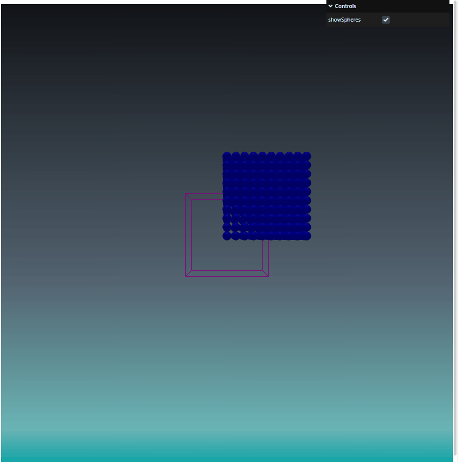

## three.js Fluid Simulation with SPH

## test step : particle gravity acceleration
I used the <b>GPUComputationRenderer</b> plugin as a means to utilize GPGPU in the three.js environment.

## implement SPH fluid simulation using GPGPU

